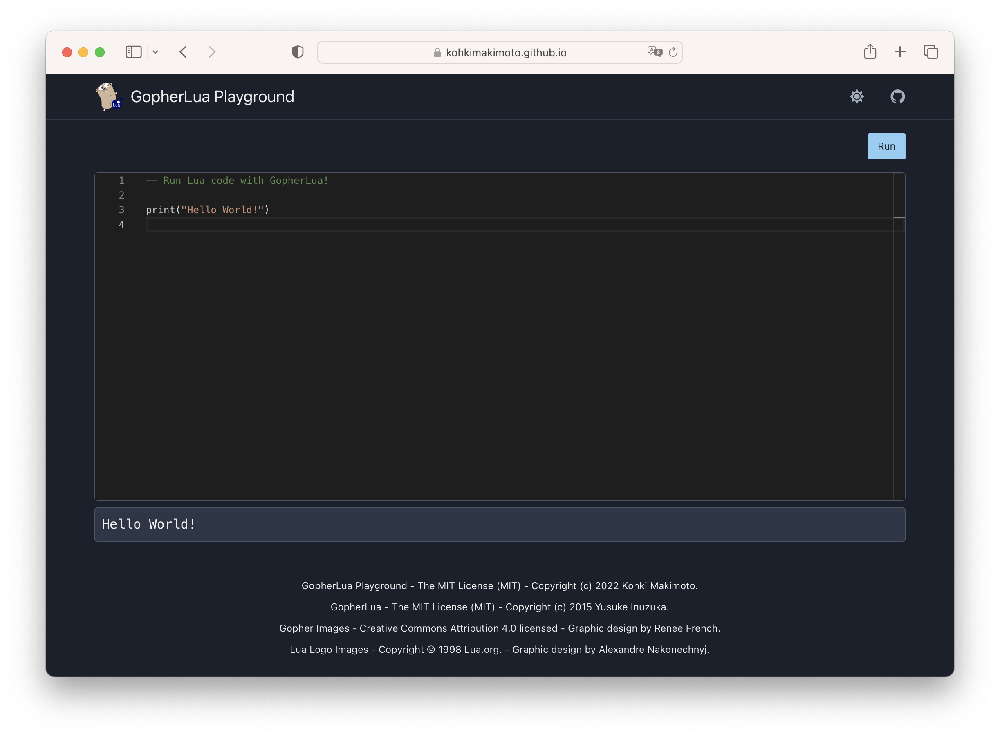

# GopherLua Playground

[GopherLua Playground](https://kohkimakimoto.github.io/gopher-lua-playground/) is a convenient website where you can play with [GopherLua](https://github.com/yuin/gopher-lua).

## Technology Stack

### GopherLua

[GopherLua](https://github.com/yuin/gopher-lua) is a Lua5.1 VM and compiler written in Go. It is created by [Yusuke Inuzuka](https://github.com/yuin).
GopherLua Playground uses it for executing Lua code in your browser.

### WebAssembly

GopherLua Playground is implemented as a static website. The Lua code can be run in your browser without any server side networking.
It is powered by WebAssembly.

## Author

Kohki Makimoto <kohki.makimoto@gmail.com>

## License

The MIT License (MIT)
